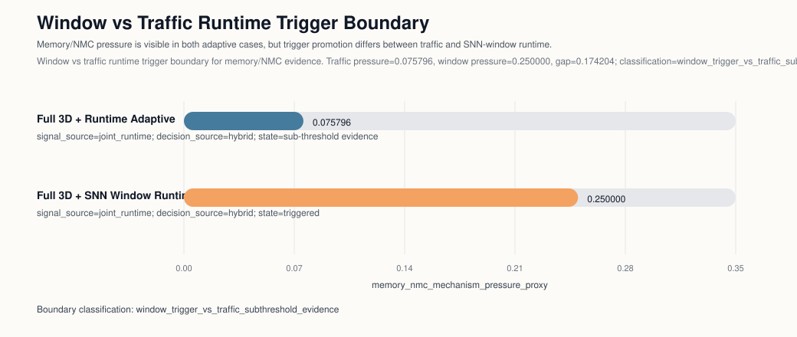

## Window vs Traffic Runtime Trigger Boundary

Caption: Window vs traffic runtime trigger boundary for memory/NMC evidence. Traffic pressure=0.075796, window pressure=0.250000, gap=0.174204; classification=window_trigger_vs_traffic_subthreshold_evidence.

- Traffic runtime case `full_3d_runtime_adaptive` keeps `memory_nmc_mechanism_pressure_proxy=0.075796` visible, but it remains sub-threshold evidence because the metric is not promoted into `control_trigger_signals`.
- Window runtime case `full_3d_snn_window_runtime_adaptive` reaches `memory_nmc_mechanism_pressure_proxy=0.250000` and promotes `memory_nmc_mechanism_pressure_proxy` into `control_trigger_signals`.
- Boundary classification: `window_trigger_vs_traffic_subthreshold_evidence`
- Pressure gap (window - traffic): `0.174204`
- Configured threshold: `0.200`
- Mechanism progression signature: `controller_outstanding -> controller_outstanding -> memory_barrier_coupling_proxy`

Interpretation: Traffic runtime keeps memory/NMC pressure visible, but it remains sub-threshold evidence because memory_nmc_mechanism_pressure_proxy is not promoted into control_trigger_signals. Window runtime crosses the semantic boundary by promoting memory_nmc_mechanism_pressure_proxy into the trigger set. The configured trigger threshold is 0.200.

Mechanism progression note: fixed-step window-route is dominated by controller_outstanding; stop-window remains controller_outstanding, without same-controller overlap; runtime compare shifts to memory_barrier_coupling_proxy.
