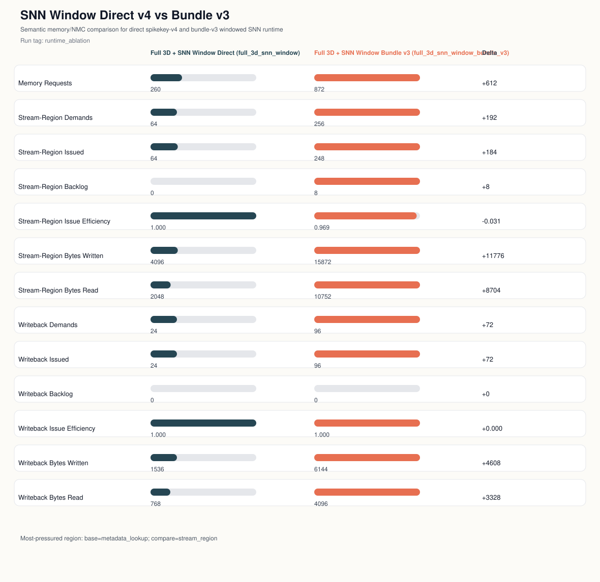
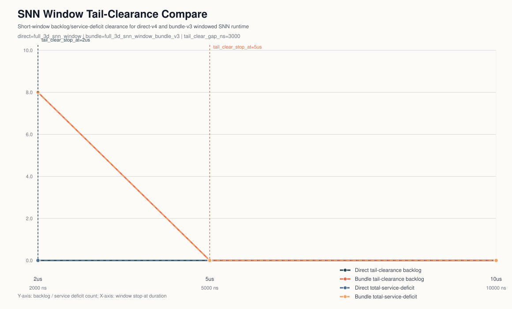

## SNN Window Paired Figures

Left: `phase2_snn_window_route_memory_compare.svg`

Right: `phase2_snn_window_tail_compare.svg`

Caption: Paired view of SNN-window route-memory behavior: the left panel captures semantic pressure under the selected runtime window, while the right panel isolates the short-tail clearance gap that remains after bundle forwarding. Observed tail_clear_gap_ns=3000 (2us -> 5us).

Key tail note: tail_clear_gap_ns=3000
